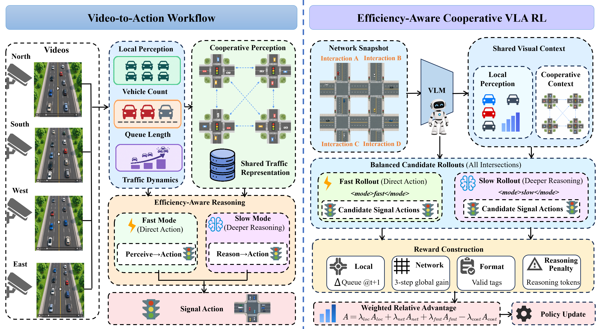

# VLALight: A Vision-Language-Action Model for Traffic Signal Control




Traffic signal control (TSC) plays an important role in managing urban traffic flow and reducing congestion. In recent years, roadside cameras have become widely deployed at signalized intersections, providing continuous visual observations of traffic conditions. However, the potential of using these visual observations directly for traffic signal control remains largely unexplored. Most reinforcement learning and large language model (LLM)-based controllers still rely on complete, structured traffic states provided by simulators, which offer an idealized description of traffic conditions. Recent vision-language models (VLMs) introduce visual scene understanding, but commonly use VLMs as perception modules or high-level planners while delegating signal control to separate RL or language-model components. To bridge this gap, we present VLALight, an end-to-end vision-language-action (VLA) model for traffic signal control. Specifically, VLALight extracts traffic information from physical visual observations and reasons over dynamic scenes with multiple vehicles, lanes, and directions. It then incorporates information from neighbouring intersections to coordinate signal decisions across the road network. In addition, we introduce a cooperative reinforcement learning framework that leverages local and network-level traffic feedback to train a VLA agent that coordinates multi-intersection signal control and adapts its reasoning depth to traffic complexity. Experiments on seven real-world traffic-flow datasets from three urban networks, rendered in a video-enabled traffic simulator, show that VLALight achieves strong and generalizable control performance across diverse traffic scenarios.
## Project Structure

The main implementation is located in `VLMTSCS/`:

- `run_video.py`: main entry point for video-based VLALight inference and simulation.
- `models/video_agent.py`: VLA agent that processes rendered visual observations and produces traffic-signal decisions.
- `models/`: traffic-signal agents and supporting model implementations.
- `data/`: road networks, traffic-flow files, phase mappings, and scenario metadata for Jinan, Hangzhou, and New York.
- `TransSimHub/`: video-enabled traffic simulation and rendering environment.
- `stage2_prompt_flattened_experiment/`: Stage 2 decision prompts and prompt examples.
- `training/ada_v1/verl/`: online cooperative GRPO training code, reward computation, advantage estimation, and PPO actor updates.
- `training/LlamaFactory/`: SFT configurations and tooling for the visual-perception and cooperative-decision LoRA stages; training data and model weights are supplied separately.
- `utils/`: SUMO, VLM, rendering, checkpoint, and data-processing utilities.
- `requirements-vlalight.txt`: dependencies exported from the local `vlmlight` environment.

## Video-Agent Architecture

`models/video_agent.py` handles inference for one intersection; it does not run the simulator or coordinate the network by itself. The deployed multi-intersection path is:

1. `run_video.py` selects `VideoAgent` and reuses the argument parsing, scenario setup, and collector from `run_v35.py` and `run_v34.py`. `utils/vlm_config.py` supplies road-network, phase, rendering, and API defaults. The selected scenario files live under `data/`.
2. `utils/vlm_oneline.py` owns the SUMO loop through `utils/sumo_env.py`. Its renderer (`TransSimHub`, or `utils/parallel_renderer.py` when enabled) produces camera observations. `utils/image_saver.py` and `utils/decision_window_recorder.py` prepare the four direction-specific decision-window videos and available upstream coordination frames.
3. At each decision step, the collector calls `VideoAgent.run_stage1()` for every intersection. The agent builds the visual request using `utils/v35_video_prompt.py` and calls the configured OpenAI-compatible model endpoint. The collector waits until all local `<perception>` results are available, then constructs each intersection's cooperative inputs from the network-wide results.
4. The collector calls `VideoAgent.run_stage2()` for every intersection with its local and routed neighbor perception. The agent fills `stage2_prompt_flattened_experiment/stage2_cooperative_decision_prompt_formal.txt`, selects Fast or Slow using the model's mode-token scores and configured threshold, and parses `<signal>` into one of `ETWT`, `NTST`, `ELWL`, or `NLSL`. Forced Fast/Slow settings are inference ablations. Invalid Stage 2 signal output uses the deterministic V25-style phase fallback; certain invalid Stage 1 outputs can use SUMO-derived perception instead.
5. Only after the intersections' actions are collected does `utils/vlm_oneline.py` advance SUMO. It also owns metrics, vehicle logs, decision records, and optional resumable checkpoints. `VideoAgent` writes per-intersection conversations under the run directory's `conversations/stage1/` and `conversations/stage2/`.

The online RL code under `training/ada_v1/verl/` is a separate training pipeline. It trains model weights consumed through the inference endpoint; `run_video.py` does not load VERL checkpoints or perform RL updates directly. Deploy a compatible exported model and set the endpoint/model ID before running an evaluation.


## Video-Agent Inference

Run a complete simulation with a traffic-flow file from the selected dataset:

```bash
cd VLMTSCS
python -u run_video.py \
  --dataset newyork \
  --traffic-file anon_28_7_newyork_real_double.json \
  --seed 42 \
  --work-dir records/video_agent/newyork_double_seed42
```

Replace `--dataset` and `--traffic-file` with the corresponding files under `VLMTSCS/data/` for Jinan, Hangzhou, or New York.

## Supervised Fine-Tuning

Run the two LoRA stages from the LlamaFactory directory. The first trains visual perception; merge its adapter before starting the cooperative decision and Fast/Slow mode stage:

```bash
cd VLMTSCS/training/LlamaFactory
llamafactory-cli train examples/train_lora/qwen35_4b_v35_local_perception_512x960_hpc_lora.yaml
llamafactory-cli export examples/merge_lora/qwen35_4b_v35_local_perception_coord_512x960.yaml
llamafactory-cli train examples/train_lora/qwen35_4b_v35_stage2_cooperative_mode_hpc_lora.yaml
llamafactory-cli export examples/merge_lora/qwen35_4b_v35_stage2_cooperative_mode.yaml
```

Set `model_name_or_path` in the first training and merge configurations to the local Qwen3.5-4B checkpoint, and prepare the datasets named in both training configurations before running these commands. Base weights, SFT datasets, and generated checkpoints are external prerequisites, not included in this anonymous repository. The final merged checkpoint is the initial model for online training.

## Online Training

The cooperative online training workflow is under `VLMTSCS/training/ada_v1/verl/`. Its runtime dependency chain is:

1. `v35_online_cooperative_grpo/run_formal_online_cooperative_grpo.sh` runs preflight and starts `verl.trainer.main_ppo`. `verl/trainer/config/online_cooperative_grpo.yaml` selects the V1 trainer, initial model, bootstrap JSONL files, and batch settings; `v35_online_cooperative_grpo/online_sumo.yaml` defines cities, persistent streams, decision timing, rollout count, and SUMO resources. Paths in these configurations are resolved from the `verl` working directory.
2. `v35_online_cooperative_grpo/data/online_train_bootstrap.jsonl` and `online_val_bootstrap.jsonl` identify city, stream, seed, and sample order. They are not prerecorded videos or final decisions. `online_samples.py` maps rows to persistent Jinan/Hangzhou masters; `online_config.py` combines the YAML with scenario files from `VLMTSCS/data/` through `utils/vlm_config.py`.
3. `verl/trainer/ppo/v1/online_cooperative_manager.py` connects the V1 trainer to `verl_adapter.py` and `online_runtime.py`. `sumo_adapter.py` wraps the repository's `utils/sumo_env.py`; `ray_rollout.py` manages master and candidate SUMO actors. `observation_builder.py` and `stage1_protocol.py` prepare visual observations and perception requests. The VERL generator supplies Stage 1 and Stage 2 model responses; no separate HTTP policy server is required for the formal in-process training path.
4. `stage2_protocol.py` builds cooperative decision requests. `mode_assignment.py` balances six same-snapshot candidates between forced Fast and Slow; `online_rollout.py` and `online_reward.py` turn their trajectories into per-intersection records with network, local, reasoning-cost, and format feedback. The selected network action advances its persistent master stream.
5. `verl/trainer/ppo/v1/trainer_base.py` computes grouped advantages and mode targets, using `v35_offline_grpo/perception_sft.py` for the mode comparison and token masks. `verl/workers/utils/losses.py` applies the Stage 1 perception, mode, reasoning, and signal objectives during actor updates. Checkpoints, rollout records, diagnostics, and TensorBoard logs belong to the run ID created by the launcher.

The formal launcher is:

```bash
cd VLMTSCS/training/ada_v1/verl
CUDA_VISIBLE_DEVICES=0,1,2,3 \
V35_RENDER_EGL_DEVICES=0,1,2,3 \
NPROC_PER_NODE=4 \
V35_MODEL_DIR=../../LlamaFactory/saves/qwen35-4b/merged/v35_stage2_cooperative_mode \
bash v35_online_cooperative_grpo/run_formal_online_cooperative_grpo.sh --fresh \
  trainer.use_v1=true \
  trainer.total_epochs=1 \
  data.train_max_samples=1000 \
  data.train_batch_size=4 \
  data.gen_batch_size=4 \
  actor_rollout_ref.actor.ppo_mini_batch_size=4
```

The 1,000-row limit permits at most 250 batches of four source samples in this one-epoch run; it does not guarantee that all 1,000 rows will complete training. Each batch uses four persistent SUMO streams: two Jinan and two Hangzhou, not four different road networks. Online collection expands these source samples into per-intersection Fast/Slow candidates; the actor updates on the complete expanded collection, so the effective optimizer mini-batch is larger than four candidate rows. The `--fresh` flag starts a new run and must be omitted when resuming an existing run with its original `V35_RUN_ID`.

`V35_MODEL_DIR` is resolved relative to `VLMTSCS/training/ada_v1/verl` and passed to both preflight and the trainer. Point it to the merged Stage 2 model on your machine; no machine-specific path needs to be committed. To evaluate a trained checkpoint, export it to a model directory supported by your inference server, serve that model through an OpenAI-compatible chat endpoint, and pass its served model ID with `run_video.py --decision-model`. The inference command above also requires that endpoint to be running; training does not start it automatically.
